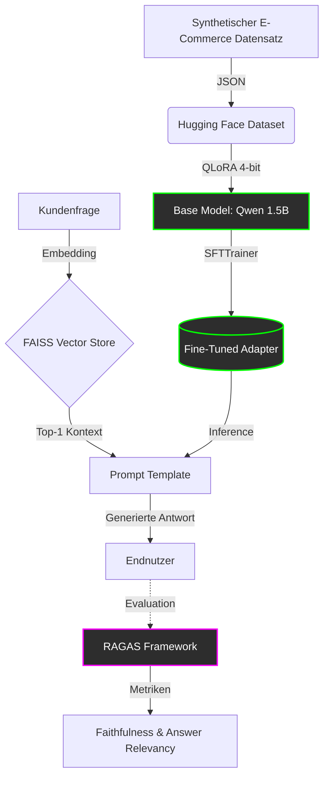

#  LLM RAG Framework mit Domain-Specific Fine-Tuning & RAGAS Evaluation

##  Projektübersicht
Dieses Projekt demonstriert eine End-to-End Pipeline zur Entwicklung, zum Fine-Tuning und zur Evaluation eines spezialisierten Large Language Models (LLM) für den E-Commerce-Sektor. 

Anstatt ein generisches Modell zu nutzen, wird ein kleines, effizientes Open-Source-Modell (**Qwen2.5-1.5B-Instruct**) mittels **QLoRA/PEFT** auf E-Commerce Produkt-Q&A-Daten fine-getunt. Anschließend wird das Modell in eine **RAG (Retrieval-Augmented Generation)** Architektur integriert und die Qualität der Generierung mithilfe des **RAGAS**-Frameworks objektiv gemessen.

**Ziel:** Nachweis der Fähigkeit, kosteneffiziente (Small Language Models), domänenspezifische KI-Lösungen zu bauen und deren Business-Impact (Qualität & Halluzinations-Reduktion) datengetrieben zu evaluieren.

##  Architektur & Tech Stack

| Komponente | Technologie | Zweck |
| :--- | :--- | :--- |
| **Base Model** | `Qwen/Qwen2.5-1.5B-Instruct` | Ressourcenschonendes, hochperformantes SLM |
| **Fine-Tuning** | Hugging Face `PEFT`, `TRL`, `bitsandbytes` | QLoRA (4-bit) für effizientes Training auf Consumer-Hardware (T4 GPU) |
| **RAG Retrieval** | `LangChain`, `FAISS` | Vektorbasierte Kontext-Retrieval (Produktinformationen) |
| **Evaluation** | `RAGAS` | Metriken: *Faithfulness* (Vermeidung von Halluzinationen), *Answer Relevancy* |
| **Framework** | `PyTorch`, `Transformers` | Kern-Deep-Learning-Stack |

##  Systemarchitektur

##  Evaluation Metrics & Learnings
Die Qualität des fine-getunten RAG-Systems wird anhand folgender Metriken gemessen:
1. **Faithfulness:** Misst, ob die generierte Antwort faktisch aus dem abgerufenen Produktkontext stammt.
2. **Answer Relevancy:** Bewertet, wie direkt und präzise die Antwort auf die Kundenfrage eingeht.

*Wichtiger Learnings aus der Implementierung:*
- **Hardware-Limits:** Die Nutzung eines lokalen 1.5B-Modells als "Judge" für die RAGAS-Evaluation führt auf Consumer-Hardware (Google Colab T4) zu Timeouts. In einer produktiven Architektur wird für die Evaluation ein dedizierter, schneller Endpoint (z.B. `gpt-4o-mini` via `llm_factory`) verwendet, während das lokale Modell nur die Inferenz (Kundenanfragen) bedient.
- **Retrieval-Qualität:** Bei sehr kleinen Datensätzen kann FAISS semantisch ähnliche, aber fachlich falsche Kontexte zurückgeben (z.B. Kamera-Frage liefert Kaffeemaschinen-Kontext). Dies unterstreicht die Notwendigkeit von Chunking-Strategien und ausreichend dichten Vektorräumen im Produktiveinsatz.

##  Installation & Nutzung

### Voraussetzungen
* Python 3.10+
* NVIDIA GPU (min. 16GB VRAM, z.B. T4 in Google Colab)

